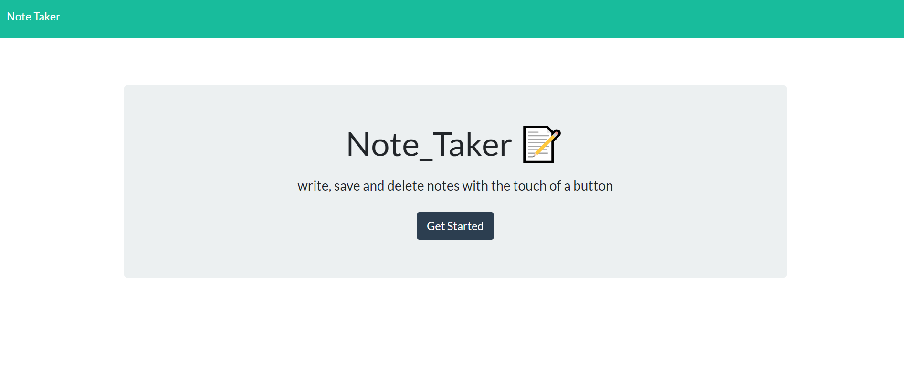
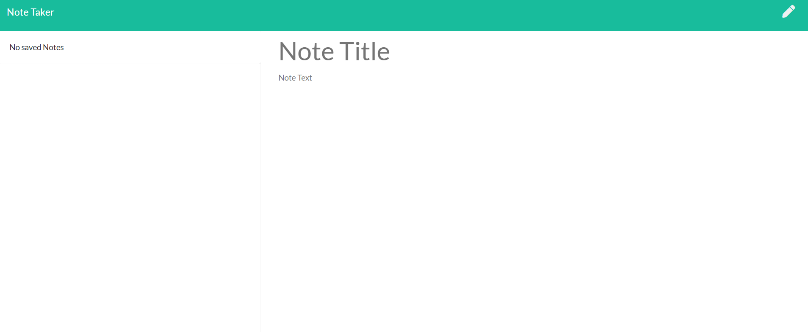
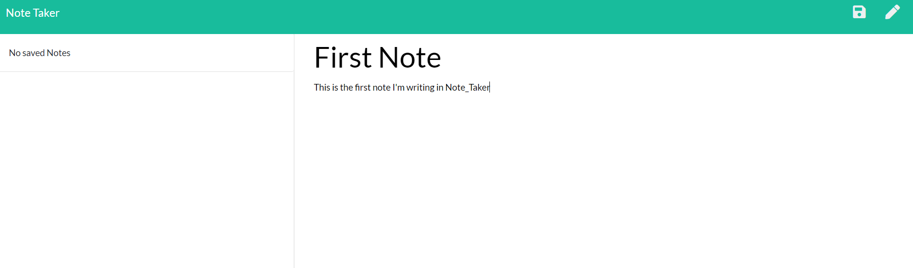
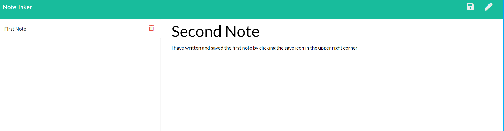
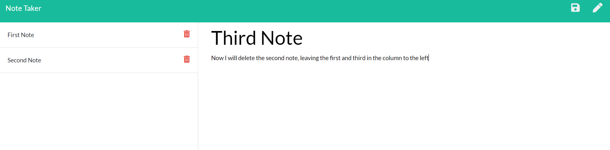
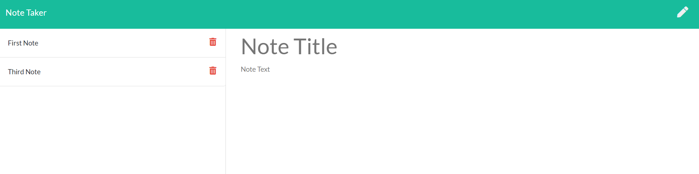

# Note_Taker

# Table of Contents
* [Description](#description)
* [User_Story](#user_story)
* [Using_Note_Taker](#using_note_taker)
* [Demo](#demo)
* [Github_Links](#github_links)
* [Email_Address](#email_address)
* [Project_Images](#project_images)

# Description

An application that can be used to write, save and delete notes.

# User_Story

Life in 2020 moves faster than ever, between work, family and social commitments, people are looking for an easy and efficient way to keep track of their schedule and activities. Traditionally someone might have a paper planner, but once data is entered it’s not always easy to edit or delete. With the digital Note_Taker, you can now make your entrees and have the confidence to edit and update them with the simple touch of a button. 

Use Note_Taker for...
Work - so you don't forget industry changing ideas,  or miss that critical meeting reminder.
Family - Birthdays, Anniversaries, or even just that grocery list that you want at the tip of your fingers.
Social - Save that date to get together with friends, or jot down your thoughts that you want to capture about this time that we are living through. 

# Using_Note_Taker

Want to sample Note_Taker? 
Click this link...
https://damp-refuge-48141.herokuapp.com/notes

# Demo

Click here to see Note_Taker's function...
https://drive.google.com/file/d/11TU7RTChnoRjadAzSpOitCDwaKhqKYZX/view

# Github_links

https://joewills615.github.io/Note_Taker/

https://github.com/JoeWills615/Note_Taker

# Email_Address

JoeWills615@gmail.com

# Project_Images

 

   
   

  
  
   
   

  

   
   

  

   
   

  

    
   

  

